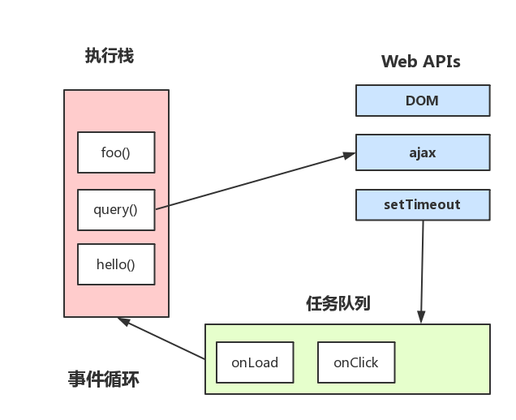

<!-- TOC -->

- [javascript](#javascript)
  - [引擎运行](#引擎运行)
  - [数据类型](#数据类型)
  - [**== 类型转换**](#-类型转换)
  - [变量](#变量)
  - [this](#this)
  - [对象](#对象)
  - [函数](#函数)
  - [闭包](#闭包)
  - [继承](#继承)
    - [es5 继承 (寄生组合继承)](#es5-继承-寄生组合继承)
    - [new](#new)
    - [es5 原型与 class](#es5-原型与-class)
  - [垃圾回收](#垃圾回收)
    - [内存泄漏](#内存泄漏)
  - [Event Loop](#event-loop)
  - [异常捕获](#异常捕获)
  - [其他](#其他)
  - [严格模式](#严格模式)
  - [window 对象](#window-对象)
    - [onload 事件](#onload-事件)
  - [html 中 javascript 程序执行过程](#html-中-javascript-程序执行过程)
  - [模块化](#模块化)
    - [js 模块加载原理](#js-模块加载原理)
    - [commonjs](#commonjs)
    - [AMD](#amd)
    - [UMD](#umd)
    - [CMD](#cmd)
    - [es6 module](#es6-module)
  - [例题](#例题)
    - [resize 和 scroll 事件的性能优化](#resize-和-scroll-事件的性能优化)
    - [浅拷贝和深拷贝](#浅拷贝和深拷贝)
    - [Object.create()的 polyfill](#objectcreate的-polyfill)
    - [null 与 undefined 区别](#null-与-undefined-区别)

<!-- /TOC -->

# javascript

## 引擎运行

**核心的 JIT 编译器将源码编译成机器码运行**。

词法分析-> 语法分析-> 字节码->机器码

字节码只在运行时编译，用到哪一行就编译哪一行，并且缓存(inline cache)

## 数据类型

**原始类型**：number、string、boolean、null、undefined、symbol(ES6 新增)

**对象类型**：object(array，function)

原始类型不可变，对象类型可变。

对象类型具有属性；在使用 string、number、boolean 原始类型方法时，js 会在调用 new String()等方式将 string、number、boolean 转成对应的对象，从而进行属性的引用。但如果给 string 类型添加属性，js 会忽略并返回 undefined。

```javascript
const a = 'test'
a.len = 4
a.len // undefined
```

`string.replace()`默认替换第一个字符，全部替换要用正则`/***/g`

## **== 类型转换**

`ToNumber(A)` 尝试在比较前将参数 A 转换为数字，这与 +A（单目运算符+）的效果相同。`ToPrimitive(A)`通过尝试依次调用 A 的`A.toString()` 和 `A.valueOf()` 方法，将参数 A 转换为原始值（Primitive）

`falsy value` : 0 , NaN,"", false, null , undefined

## 变量

**变量提升**：使用`var`变量声明或函数声明会被提升到作用域的顶部。使用`let`或`const`的声明不会发生`变量提升`。

**执行上下文**：

- JS 有`执行上下文`
- 浏览器首次载入脚本，将创建`全局执行上下文`，并压入执行栈栈顶（不可被弹出）
- 然后每进入其它作用域就创建对应的执行上下文并压入执行栈的顶部
- 一旦对应的上下文执行完毕，就从栈顶弹出，并将上下文控制权交给当前的栈。
- 这样依次执行（最终都会回到全局执行上下文）

**作用域**

- 全局作用域
- 函数（局部）作用域 ——函数作用域的同名变量会遮盖全局作用域的同名变量
- 块级作用域（es6）

**作用域链**

1.  在函数上下文中，查找一个变量 foo
2.  如果函数的 VO 中找到了，就直接使用
3.  否则去它的父级作用域链中（**parent**）找
4.  如果父级中没找到，继续往上找
5.  直到全局上下文中也没找到就报错

## this

**this 是执行上下文环境的一个属性，而不是某个变量对象的属性**。

this 是没有一个类似搜寻变量的过程，当代码中使用了 this，这个 this 的值就直接从执行的上下文中获取了，而不会从作用域链中搜寻，this 的值只取决中进入上下文时的情况。

非严格模式下 this 默认为全局对象 window 或者 global，严格模式下为 undefined。

```javascript
var baz = 200
var bar = {
  baz: 100,
  foo: function() {
    console.log(this.baz)
  }
}
var foo = bar.foo

// 进入环境：global
foo() // 200，严格模式中会报错，Cannot read property 'baz' of undefined

// 进入环境：global bar
bar.foo() // 100

bar = {
  baz: 100,
  foo: () => console.log(this.baz) // 此处this为bar的上下文
}
bar.foo() //200
```

## 对象

**原型**：`xxx.__proto__`指向对象的原型,或者用`Object.getPrototypeOf(xxx)`得到原型

**原型链**：查询属性 x：对象 o ->对象 o 的原型 -> 对象 o 原型的原型 -> .. 直到找到 x 或找到 Object.prototype(`Object.prototype.__proto__ 为null`)为止

**构造函数**：`xxx.prototype`指向实例的原型（即类），原型通过构造函数创建实例

**原型继承**

- es5：`Object.create()`

- es3:

  ```javascript
  function inherit(p) {
    function f() {}
    f.prototype = p
    return new f()
  }
  ```


`hasOwnProperty()`检测是否是自由属性。

`propertyIsEnumberable()`检测是否是自有属性且可枚举。

**属性遍历**

`for...in...`可以遍历可枚举属性（自有属性和继承的属性），内置方法不可枚举。

es5 中新增`Object.keys()`（只有可枚举的属性）和`Object.getOwnPropertyNames()`（包括不可枚举的属性）方法。

## 函数

- 作为函数调用

  函数声明语句会被“提前”到外部作用域的顶部。

  函数可以访问嵌套的外部函数的参数和变量。

  es3 和非严格模式中，this 的值是全局对象；严格模式下，this 的值是 undefined。

- 作为方法调用

  作为对象的方法。方法函数中，this 的值是对象。

  **链式调用**：在方法函数中返回 this。

  this 不会继承，只跟作为方法调用（**对象**）还是函数调用（全局对象或 undefined）有关。

- 作为构造函数调用

  new 调用

- 间接调用 — **call**和**apply**

  **call**：以参数列表传入

  **apply**：以数组形式传入

  ```javascript
  f.call(o) // 或 f.apply(o)
  // 等价于
  o.m = f
  o.m()
  delete o.m
  ```

  **bind**：将函数绑定到对象上，成为方法(与 call,apply 不同，返回一个函数而不是直接调用)

  ```javascript
  g = f.bind(o)
  g() // 等价于 o.f()
  // bind 实现柯里化
  const sum = function(x, y) {
    return x + y
  }
  const succ = sum.bind(null, 1)
  succ(2) // 3
  succ(3) // 4
  ```

`arguments.callee`参数当前正在执行的函数

函数属性：函数即对象，可以定义函数的属性来保存数据。（可以用闭包实现）

```javascript
func.counter = 0
function func() {
  return func.counter++
}
```

## 闭包

## 继承

### es5 继承 (寄生组合继承)

```javascript
function ParentClass(name) {
  this.name = name
}
ParentClass.prototype.sayHello = function() {
  console.log("I'm parent!" + this.name)
}
function SubClass(name, age) {
  //  若是要多个参数可以用apply 结合 ...解构
  //  调用父类的构造函数
  ParentClass.call(this, name)
  // ....
}
SubClass.prototype = Object.create(ParentClass.prototype)
SubClass.prototype.sayChildHello = function(name) {
  console.log("I'm child " + this.name)
}
```

### new

new 关键字就意味着一次内存分配。在初始化的时候新建对象，在后续中尽量多重用这些创建好的对象。

- 第一步：创建一个新对象
- 第二步：将构造函数的作用域赋给新对象（this）
- 第三步：执行构造函数中的代码（为新对象添加属性）
- 第四部：返回新的对象

另外还有以下三种内存分配表达式：

- {} （创建一个新对象）
- [] （创建一个新数组）
- function() {…}

### es5 原型与 class

- es5 的每个对象的`__proto__`属性指向构造函数的 prototype 属性；
- Class 同时具有 prototype 属性和`__proto__`属性
- 子类的`__proto__`继承构造函数，指向父类
- 子类 prototype 属性的`__proto__`继承方法，指向父类的`prototype`属性
- Class 没有变量提升，是严格模式
- class 可以加 static 实现静态方法，静态属性必须按 es5 的办法
- new 的时候用 new.target 判断构造函数，因此必须用 new 来调用

## 垃圾回收

js 会自动进行垃圾回收机制。

Javascript 引擎基础 GC 方案是标记清除，遍历所有可访问的对象，回收已不可访问的对象。当变量进入执行环境是，就标记这个变量为“进入环境”。当变量离开环境时，则将其标记为“离开环境”。

变量设置为 null，则会在下次进行垃圾回收

缺点：**GC 时，停止响应其他操作**

优化：

- 分代回收：多回收临时对象，少回收持久对象。
- 增量回收：每次处理一点，下次再处理一点。

### 内存泄漏

1.  部分闭包造成的循环引用。
2.  在 IE 中，如果闭包的作用域链中存在 HTML 元素，那么就无法被销毁导致内存泄露。

## Event Loop

事件循环是 js 代码执行的逻辑。

- JS 分为同步任务和异步任务
- 同步任务都在主线程上执行，形成一个`执行栈`
- 主线程之外，**事件触发线程**管理着一个`任务队列`，只要异步任务有了运行结果，就在`任务队列`之中放置一个事件。
- 一旦`执行栈`中的所有同步任务执行完毕（此时 JS 引擎空闲），系统就会读取`任务队列`，将可运行的异步任务添加到可执行栈中，开始执行。



**macrotask 与 microtask**

在一个 macrotask（如主代码）结束后，会优先执行 microtask，再执行下一个 macrotask。

- macrotask：**主代码块**，定时器， I/O，UI 渲染等（事件队列中的每一个事件都是一个 macrotask）
- microtask：Promise，process.nextTick，mutation observer 等


**在 node 环境下，process.nextTick 的优先级高于 Promise**

## 异常捕获

- `try catch`
- `promise` 中的`catch` 和`reject`

  ```javascript
  throw Error('永远无法被捕获')
  //该错误信息无法在catch中捕获
  ```

- `window.onerror`
  `window.onerror`包含了`try...catch`的优势，而`try...catch`无法捕获的语法错误和全局异常处理，`window.onerror`都可以做到。不过，由于是全局监测，就会统计到浏览器插件中的 js 异常。

- **js 原生错误类型**
  - SyntaxError 解析代码时发生的语法错误。
  - ReferenceError 引用一个不存在的变量时发生的错误。
  - RangeError 当一个值超出有效范围时发生的错误。
  - TypeError 是变量或参数不是预期类型时发生的错误。

## 其他

`for...in...`

转换为可枚举的对象后，根据对象的属性（字符串）来进行遍历。

作用于数组的 for-in 循环除了遍历数组元素以外,还会遍历自定义属性。

`for...of...`

在可迭代对象（包括 Array，Map，Set，String，TypedArray，arguments 对象等等）上创建一个迭代循环。

## 严格模式

- 不允许不使用 var 关键字去创建全局变量，抛出 ReferenceError
- 不允许对变量使用 delete 操作符，抛 ReferenceError
- 不可对对象的只读属性赋值，不可对对象的不可配置属性使用 delete 操作符，不可为不可拓展的对象添加属性，均抛 TypeError
- 对象属性名必须唯一
- 函数中不可有重名参数
- 在函数内部对修改参数不会反映到 arguments 中
- 淘汰 arguments.callee 和 arguments.caller
- 不可在 if 内部声明函数
- 抛弃 with 语句

## window 对象

Element 对象有 style 和 className 属性，允许修改 css 样式和类名。

### onload 事件

当文档内容稳定并可以操作时会触发。

## html 中 javascript 程序执行过程

1.  载入文档内容，并执行`<script>`元素里的代码，按照出现和从上往下的顺序执行。
2.  文档载入完并且脚本执行完后，进入事件驱动阶段：触发 load 事件，并调用事件处理程序函数（鼠标和键盘等事件）。

javascript 脚本的加载默认是同步和阻塞的。`defer`属性会延迟脚本的执行直到文档的载入和解析完成。`async`属性会让浏览器尽可能快执行脚本，两者皆有时会遵从`async`属性。

## 模块化

### js 模块加载原理

**原理一：_id 即路径_ 原则。**

通常入口是这样的： require( [ 'a', 'b' ], callback ) 。这里的 'a'、'b' 都是 ModuleId。通过 id 和路径的对应原则，加载器才能知道需要加载的 js 的路径。在这个例子里，就是 baseUrl + 'a.js' 和 baseUrl + 'b.js'。

但 id 和 path 的对应关系并不是永远那么简单，比如在 AMD 规范里就可以通过配置 Paths 来给特定的 id 指配 path。

**原理二：createElement('script') & appendChild**

一般是通过 **createElement('script') & appendChild** 去请求路径对应的 js 模块。

一般来说，需要给 `<script>` 设置一个属性用来标识模块 id, 作用后面会提到。

**原理三：document.currentScript**

a.js 里可能是 define(id,factory) 或者是 define(factory)，后者被称为匿名模块。那么当 define(factory) 被执行的时候，我们怎么知道当前被定义的是哪个模块呢？ 答案是通过 **document.currentScript** 获取当前执行的`<script>`，然后通过上面给 script 设置的属性来得到模块 id。

需要注意的是，低级浏览器是不支持 currentScript 的，这里需要进行浏览器兼容。**在高级浏览器里面，还可以通过 script.onload 来处理这个事情。**

**原理四：依赖分析**

模块在被 Define 之后并不是马上可以用了，在你执行它的 factory 方法来生产出最终的 export 之前，你需要保证它的依赖是可用的。那么首先就要先把依赖分析出来。

简单来说，就是通过 toString 这个方法得到 factory 的内容，然后用正则去匹配其中的 require( 'moduleId')。当然也可以不用正则。

这就是为什么`require(var)`这种带变量的语句是不被推荐的，因为它会影响依赖分析。如果一定要用变量，可以用`require([var])`这种异步加载的方式。

**原理五：递归加载**

在分析出模块的依赖之后，我们需要递归去加载依赖模块。

### commonjs

服务器端模块的规范。`require`是同步的，但浏览器天生异步，无法正常加载模块。因为同步的加载模块会产生性能、可用性、debug 调试、跨域访问等问题。

```javascript
let { stat, exists, readFile } = require('fs')
```

### AMD

AMD 是`Asynchronous Module Definition`的缩写，例如`requirejs`。
采用异步方式加载模块，模块的加载不影响它后面语句的运行。所有依赖这个模块的语句，都定义在一个回调函数中，等到加载完成之后，这个回调函数才会运行。
`requireJS`使用之前必须配置，同时该配置很难重用。

流程：

1.  我们在使用 requireJS 时，都会把所有的 js 交给 requireJS 来管理，把 data-main 指向我们的 main.js。

2.  通过我们在 main.js 里面定义的 require 方法或者 define 方法，requireJS 会把这些依赖和回调方法都用**数据结构**保存起来。

3.  当页面加载时，requireJS 会根据这些依赖预先把需要的 js 通过 document.createElement 的方法引入到 dom 中，这样，被引入 dom 中的 script 便会运行。

4.  由于我们依赖的 js 也是要按照 requireJS 的规范来写的，所以他们也会有 define 或者 require 方法，同样类似第二步这样循环向上查找依赖，同样会把他们存起来。

5.  当我们的 js 里需要用到依赖所返回的结果时(通常是一个 key value 类型的 object),requireJS 便会把之前那个保存回调方法的数据结构里面的方法拿出来并且运行，然后把结果给需要依赖的方法。

### UMD

UMD 是 commonjs 和 AMD 的混合。UMD 的实现很简单：

1.  先判断是否支持 Node.js 模块格式（exports 是否存在），存在则使用 Node.js 模块格式。
2.  再判断是否支持 AMD（define 是否存在），存在则使用 AMD 方式加载模块。
3.  前两个都不存在，则将模块公开到全局（window 或 global）

### CMD

`CMD`即`Common Module Definition`通用模块定义。`CMD`和`AMD`在模块定义方式和模块加载（可以说运行、解析）时机上有所不同。

```javascript
define(function(require, exports, module) {
  // 模块代码
})
```

`AMD`是依赖关系前置,在定义模块的时候就要声明其依赖的模块;

`CMD`是按需加载依赖就近,只有在用到某个模块的时候再去 require;

### es6 module

ES6 模块的设计思想是尽量的静态化，使得编译时就能确定模块的依赖关系，以及输入和输出的变量。CommonJS 和 AMD 模块，都只能在运行时确定这些东西。

CommonJS 模块输出的是一个值的拷贝，ES6 模块输出的是值的引用（会改变引入的值）。

CommonJS 模块是运行时加载，ES6 模块是编译时输出接口。

## 例题

### resize 和 scroll 事件的性能优化

resize: debounce

```javascript
var debounce = function(idle, action) {
  var last
  return function() {
    var ctx = this,
      args = arguments
    clearTimeout(last) // 将上一次的定时事件取消
    last = setTimeout(function() {
      action.apply(ctx, args)
    }, idle)
  }
}
```

​
scroll：throttle

```javascript
var throttle = function(delay, action) {
  var last = 0
  return function() {
    var curr = +new Date() // performance.now()更好
    if (curr - last > delay) {
      action.apply(this, arguments)
      last = curr
    }
  }
}
```

### 浅拷贝和深拷贝

浅拷贝：引用复制和 Object.assign

深拷贝：

- 利用 Array 的 slice 和 concat 方法
- Json 的 parse 和 stringify
- 实现
  ```javascript
  function deepClone(initalObj, finalObj) {
    var obj = finalObj || {}
    for (var i in initalObj) {
      /* 遍历原有对象属性*/
      /* 避免相互引用对象导致死循环，如initalObj.a = initalObj的情况*/
      var prop = initalObj[i]
      if (prop === obj) {
        continue
      }
      if (typeof prop === 'object') {
        obj[i] = prop.constructor === Array ? [] : Object.create(prop)
      } else {
        obj[i] = prop
      }
    }
    return obj
  }
  ```

### Object.create()的 polyfill

```javascript
function pureObject(obj) {
  //定义了一个临时构造函数
  function F() {}
  //将这个临时构造函数的原型指向了传入进来的对象。
  F.prototype = obj
  //返回这个构造函数的一个实例。该实例拥有obj的所有属性和方法。
  //因为该实例的原型是obj对象。
  return new F()
}
```

### null 与 undefined 区别

相同点:

- 在 `if`判断语句中,值都默认为 `false`
- 大体上两者都是代表**无**,具体看差异

差异:

- `null`转为数字类型值为 0,而`undefined`转为数字类型为 `NaN(Not a Number)` (Number.parseInt()都是 NaN)
- `undefined`是代表调用一个值而该值却没有赋值,这时候默认则为`undefined`
- `null`是一个很特殊的对象,最为常见的一个用法就是作为参数传入(说明该参数不是对象)
- 设置为`null`的变量或者对象会被内存收集器回收
