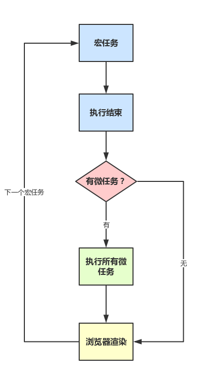

# 前端面试准备

## HTML

**HTML**的**文档源**：由**协议**、**主机名**（域名）和**端口**决定。

`window.onffline`当离线时触发,`window.ononline`当返回在线状态时触发。

### 标签

`<pre>`标签会预定义格式化的文本，但会保留空格和换行符。`<code>`标签表示计算机源码

### 存储

#### localStorage 和 sessionStorage

**区别**：存储的**有效期**和**作用域**不同。

**localStorage**：浏览器内的**永久性存储**，除非用户或者 Web 应用删除；**同源**的可以共享读取或覆盖，非同源的无法读取或覆盖。

**sessionStorage**：存储在标签页或窗口内，一旦永久关闭就被删除。**同源且同窗口**可以共享，非同源或同源但非同窗口的不能共享。

**API**

```javascript
localStorage.setItem('x', 1)
localStorage.getItem('x')
```

**存储事件**

当 localStorage 或 sessionStorage 中的数据真正变化时，会在其他对该数据可见的窗口对象上触发存储事件（进行改变的窗口不会触发）


#### cookie

HTTP 协议的一种拓展；在 Web 浏览器和 Web 服务器之间传输。服务端可以操作客户端的 cookie；

**有效期**：持续在 Web 浏览器会话期间，与 sessionStorage 不同，不会局限在窗口中，而与浏览器进程相关。可以设置**max-age**(s)来控制。

**作用域**：通过**文档源**和**文档路径**来确定，与创建它的 Web 页面有关，并对该页面可见。设置 path 和 domain 属性控制。

**HttpOnly**: 告知浏览器不允许通过脚本 document.cookie 去更改这个值，同样这个值在 document.cookie 中也不可见。但在 http 请求张仍然会携带这个 cookie。注意这个值虽然在脚本中不可获取，但仍然在浏览器安装目录中以文件形式存在。这项设置通常在服务器端设置。

**secure**：设置为 true 时，只能通过 HTTPS 等安全协议来传输。

```javascript
document.cookie = 'version=aaa;path=path;domain=domain;secure;max-age=64000'
```

**局限性**：旧浏览器保存不能超过 300 个，Web 服务器不能超过 20 个，每个 cookie 不能超过 4KB；

#### cookie vs session

cookie 存储于浏览器端，而 session 存储于服务端。

cookie 的安全性相比于 session 较弱，别人可以分析存放在本地的 COOKIE 并进行 COOKIE 欺骗，考虑到安全应当使用 session。

session 会在一定时间内保存在服务器上。当访问增多时，会占用服务器的资源，所以考虑到服务器性能方面，可以使用 cookie。

单个 cookie 保存数据不能超过 4k，且很多浏览器限制一个站点最多保存 20 个 cookie； session 默认大小一般是 1024k。

```
在登陆页面，用户登陆了

此时，服务端会生成一个session，session中有对于用户的信息（如用户名、密码等）

然后会有一个sessionid（相当于是服务端的这个session对应的key）

然后服务端在登录页面中写入cookie，值就是:jsessionid=xxx

然后浏览器本地就有这个cookie了，以后访问同域名下的页面时，自动带上cookie，自动检验，在有效时间内无需二次登陆。
```


#### HTML5 离线缓存

**应用程序缓存**与一般的浏览器缓存不同，：不会随着浏览器缓存清除而被清除，也不会被最近访问的数据替代。

通过 manifest 文件进行控制：在文件中定义那些需要缓存的文件；支持 manifest 的浏览器，会将按照 manifest 文件的规则，将资源保存在本地，从而在没有网络链接的情况下也能访问页面。

**流程**

当我们第一次正确配置 app cache 后，当我们再次访问该应用时，浏览器会首先检查 manifest 文件是否有变动，如果有变动就会把相应的变更进行资源下载，同时改变浏览器里面的 app cache，如果没有变动，就会直接把 app cache 的资源返回。

**API**

通过`window.applicationCache`相关 api 来控制。

```javascript
window.applicationCache.update() // 强制更新缓存
window.applicationCache.swapCache() // 弃用老的缓存，但不会重新载入已载入的html文件，图片等资源
```

**如何更新缓存**

更新 manifest 文件 / 通过 javascript 操作 / 清除浏览器缓存

**优点**

可以离线运行、可以减少资源请求、可以更新资源

**缺点**

- 更新的资源，需要二次刷新才会被页面采用；
- 不支持增量更新，只有 manifest 发生变化，所有资源全部重新下载一次，资源变化时不会更新
- 缺乏足够容错机制，当清单中任意资源文件出现加载异常，都会导致整个 manifest 策略运行异常


### 多媒体

#### 图片

通过`document.images`可以遍历网页上的图片

#### 音频和视频

通过`<source>`元素来指定不同格式的媒体源

```html
<audio id="music">
	<source src="music.mp3" type="audio/mpeg">
	<source src="music.ogg" type='audio/ogg;codec="vorbis"'>
</audio>
```

### 回流和重绘

Layout，也称为Reflow，即回流。

一般意味着元素的内容、结构、位置或尺寸发生了变化，需要重新计算样式和渲染树

Repaint，即重绘。

意味着元素发生的改变只是影响了元素的一些外观之类的时候（例如，背景色，边框颜色，文字颜色等），此时只需要应用新样式绘制这个元素就可以了

**什么时候引起回流**

```
1.页面渲染初始化
2.DOM结构改变，比如删除了某个节点
3.render树变化，比如减少了padding，字体改变
4.窗口resize
5.最复杂的一种：获取某些属性，引发回流，
很多浏览器会对回流做优化，会等到数量足够时做一次批处理回流，除了render树的直接变化，当获取一些属性时，浏览器为了获得正确的值也会触发回流，这样使得浏览器优化无效，包括
    （1）offset(Top/Left/Width/Height)
     (2) scroll(Top/Left/Width/Height)
     (3) cilent(Top/Left/Width/Height)
     (4) width,height
     (5) 调用了getComputedStyle()或者IE的currentStyle
```

**优化方案**

+ 减少逐项更改样式，最好一次性更改style，或者将样式定义为class并一次性更新
+ 避免循环操作dom，创建一个documentFragment或div，在它上面应用所有DOM操作，最后再把它添加到window.document
+ 避免多次读取offset等属性。无法避免则将它们缓存到变量
+ 将复杂的元素绝对定位或固定定位，使得它脱离文档流，否则回流代价会很高

## CSS

### BFC

在BFC中，每一个元素**左外边**与**包含块的左边**相接触（对于从右到左的格式化，右外边接触右边）

即使存在浮动也是如此（所以浮动元素正常会直接贴近它的包含块的左边，与普通元素重合），除非这个元素也创建了一个新的BFC。特点如下

1. 内部`box`在垂直方向，一个接一个的放置
2. box的垂直方向由`margin`决定，属于同一个BFC的两个box间的margin会重叠
3. BFC区域不会与`float box`重叠（可用于排版)
4. BFC就是页面上的一个隔离的独立容器，容器里面的子元素不会影响到外面的元素。反之也如此
5. 计算BFC的高度时，浮动元素也参与计算（不会浮动坍塌）

如何触发？

1. 根元素
2. `float`属性不为`none`
3. `position`为`absolute`或`fixed`
4. `display`为`inline-block`, `flex`, `inline-flex`，`table`，`table-cell`，`table-caption`
5. `overflow`不为`visible`

### IFC

行内元素自身如何显示以及在框内如何摆放 。

1. 如果几个行内框在水平方向无法放入一个行框内，它们可以分配在两个或多个垂直堆叠的行框中（即行内框的分割）
2. 行框在堆叠时没有垂直方向上的分割且永不重叠
3. 行框的高度总是足够容纳所包含的所有框。不过，它可能高于它包含的最高的框（例如，框对齐会引起基线对齐）
4. 行框的左边接触到其包含块的左边，右边接触到其包含块的右边。


## JS

### 引擎运行

**核心的JIT编译器将源码编译成机器码运行**。

词法分析-> 语法分析-> 字节码->机器码

字节码只在运行时编译，用到哪一行就编译哪一行，并且缓存(inline cache)

### 数据类型

**原始类型**：number、string、boolean、null、undefined、symbol(ES6新增)

**对象类型**：object(array，function)

原始类型不可变，对象类型可变。

对象类型具有属性；在使用string、number、boolean原始类型方法时，js会在调用new String()等方式将string、number、boolean转成对应的对象，从而进行属性的引用。但如果给string类型添加属性，js会忽略并返回undefined。

```javascript
const a='test'
a.len=4
a.len // undefined
```

`string.replace()`默认替换第一个字符，全部替换要用正则`/***/g`

### **== 类型转换**

### 变量

**变量提升**：变量或函数的声明会被提升到顶部。

**执行上下文**：

+ JS有`执行上下文`
+ 浏览器首次载入脚本，将创建`全局执行上下文`，并压入执行栈栈顶（不可被弹出）
+ 然后每进入其它作用域就创建对应的执行上下文并压入执行栈的顶部
+ 一旦对应的上下文执行完毕，就从栈顶弹出，并将上下文控制权交给当前的栈。
+ 这样依次执行（最终都会回到全局执行上下文）

**作用域**

+ 全局作用域
+ 函数（局部）作用域  ——函数作用域的同名变量会遮盖全局作用域的同名变量
+ 块级作用域（es6）

**作用域链**

1. 在函数上下文中，查找一个变量foo
2. 如果函数的VO中找到了，就直接使用
3. 否则去它的父级作用域链中（__parent__）找
4. 如果父级中没找到，继续往上找
5. 直到全局上下文中也没找到就报错

### this

**this是执行上下文环境的一个属性，而不是某个变量对象的属性**。

this是没有一个类似搜寻变量的过程，当代码中使用了this，这个 this的值就直接从执行的上下文中获取了，而不会从作用域链中搜寻，this的值只取决中进入上下文时的情况。

```javascript
var baz = 200;
var bar = {
    baz: 100,
    foo: function() {
        console.log(this.baz);
    }
};
var foo = bar.foo;

// 进入环境：global
foo(); // 200，严格模式中会报错，Cannot read property 'baz' of undefined

// 进入环境：global bar
bar.foo(); // 100

bar={
    baz:100,
    foo:()=>console.log(this.baz) //改变上下文
}
bar.foo(); //200
```

### 对象

**原型**：`xxx.__proto__`指向对象的原型

**构造函数**：`xxx.prototype`指向实例的原型（即类），原型通过构造函数创建实例

**原型继承**

+ es5：`Object.create()`

+ es3:

  ```javascript
  function inherit(p){
    function f(){}
    f.prototype=p
    return new f()
  }
  ```

**原型链**

查询属性x：对象o ->对象o的原型 -> 对象o原型的原型 -> .. 直到找到x或找到Object.prototype(`Object.prototype.__proto__ 为null`)为止


`hasOwnProperty()`检测是否是自由属性。

`propertyIsEnumberable()`检测是否是自有属性且可枚举。

**属性遍历**

`for...in...`可以遍历可枚举属性（自有属性和继承的属性），内置方法不可枚举。

es5中新增`Object.keys()`（只有可枚举的属性）和`Object.getOwnPropertyNames()`（包括不可枚举的属性）方法

### 函数

+ 作为函数调用

  函数声明语句会被“提前”到外部作用域的顶部。

  函数可以访问嵌套的外部函数的参数和变量。

  es3和非严格模式中，this的值是全局对象；严格模式下，this的值是undefined。

+ 作为方法调用

  作为对象的方法。方法函数中，this的值是对象。

  **链式调用**：在方法函数中返回this。

  this不会继承，只跟作为方法调用（**对象**）还是函数调用（全局对象或undefined）有关。

+ 作为构造函数调用

  new 调用

+ 间接调用 — **call**和**apply**

  **call**：以参数列表传入

  **apply**：以数组形式传入

  ```javascript
  f.call(o) // 或 f.apply(o)
  // 等价于
  o.m=f
  o.m()
  delete o.m
  ```

  **bind**：将函数绑定到对象上，成为方法(与call,apply不同，返回一个函数而不是直接调用)

  ```javascript
  g=f.bind(o)
  g() // 等价于 o.f()
  // bind 实现柯里化
  const sum=function(x,y){return x+y}
  const succ=sum.bind(null,1)
  succ(2) // 3
  succ(3) // 4
  ```

  

`arguments.callee`参数当前正在执行的函数

函数属性：函数即对象，可以定义函数的属性来保存数据。（可以用闭包实现）

```javascript
func.counter=0
function func(){
  return func.counter++
}
```

### 闭包

### 继承

es5和es6继承的区别


### 垃圾回收

js会自动进行垃圾回收机制。

Javascript引擎基础GC方案是标记清除，遍历所有可访问的对象，回收已不可访问的对象。

缺点：**GC时，停止响应其他操作** 

### Event Loop

事件循环是js代码执行的逻辑。

+ JS分为同步任务和异步任务
+ 同步任务都在主线程上执行，形成一个`执行栈`
+ 主线程之外，**事件触发线程**管理着一个`任务队列`，只要异步任务有了运行结果，就在`任务队列`之中放置一个事件。
+ 一旦`执行栈`中的所有同步任务执行完毕（此时JS引擎空闲），系统就会读取`任务队列`，将可运行的异步任务添加到可执行栈中，开始执行。


**macrotask与microtask**

在一个macrotask（如主代码）结束后，会优先执行microtask，再执行下一个macrotask。

+ macrotask：**主代码块**，setTimeout，setInterval等（可以看到，事件队列中的每一个事件都是一个macrotask）
+ microtask：Promise，process.nextTick等



**在node环境下，process.nextTick的优先级高于Promise** 

### 其他

`for...in...`转换为可枚举的对象后，根据对象的属性（字符串）来进行遍历

`for...of...`

### 严格模式

### window 对象

Element 对象有 style 和 className 属性，允许修改 css 样式和类名。

##### onload 事件

当文档内容稳定并可以操作时会触发。

##### html 中 javascript 程序执行过程

1.  载入文档内容，并执行`<script>`元素里的代码，按照出现和从上往下的顺序执行。
2.  文档载入完并且脚本执行完后，进入事件驱动阶段：触发 load 事件，并调用事件处理程序函数（鼠标和键盘等事件）。

javascript 脚本的加载默认是同步和阻塞的。`defer`属性会延迟脚本的执行直到文档的载入和解析完成。`async`属性会让浏览器尽可能快执行脚本，两者皆有时会遵从`async`属性。

## 框架

### React
### Vue
### PWA

+ serviceworker：实现通知功能
+ cacheStorage || indexedDB：实现页面缓存和骨架屏
+ mainfiest.json： 实现桌面图标

## 移动端

### viewport

dp：设备像素即物理像素，与屏幕有关。设备中实际使用的像素 

px：虚拟像素，在css代码中用到的逻辑像素

1px = (dpr)^2 * 1dp 


## 状态管理

Flux,Reflux,Redux,Vuex,Mobx 介绍和比较可以参考本文

[浅谈前端状态管理](https://www.w3cplus.com/javascript/talk-about-front-end-state-management.html)

## 浏览器

[参考资料](http://www.dailichun.com/2018/01/21/js_singlethread_eventloop.html)

### 浏览器进程与线程

浏览器是多进程。每个标签页或窗口相当于一个独立进程。

1. **Browser进程**：浏览器的主进程（负责协调、主控），只有一个。作用有
   + 负责浏览器界面显示，与用户交互。如前进，后退等
   + 负责各个页面的管理，创建和销毁其他进程
   + 将Renderer进程得到的内存中的Bitmap，绘制到用户界面上
   + 网络资源的管理，下载等
2. **第三方插件进程**：每种类型的插件对应一个进程。
3. **GPU进程**：最多一个，用于3D绘制等
4. **浏览器渲染进程**（浏览器内核）（Renderer进程，内部是多线程的）：默认每个Tab页面一个进程，互不影响。主要作用为页面渲染，脚本执行，事件处理等

浏览器内核（渲染进程）是多线程，在内核控制下各线程相互配合以保持同步，一个浏览器通常由以下常驻线程组成：

+ **GUI 渲染线程**——渲染浏览器界面，解析css、html，构建dom树，布局，绘制
+ **JavaScript 引擎线程**——执行js脚本
+ **定时触发器线程**——`setTimeout`和`setInterval`定时任务，防止js单线程阻塞影响计时。
+ **事件触发线程**——控制事件循环，异步事件。
+ **异步 http 请求线程**——XMLHttpRequest 

**GUI 渲染线程 与 JavaScript 引擎线程互斥！**，因此 js 执行时会阻塞浏览器渲染。

**JS如果执行时间过长就会阻塞页面。**

**WebWorker**

WebWorker只属于某个页面，不会和其他页面的Render进程（浏览器内核进程）共享。**WebWorker只是属于render进程下的一个线程 **。

**SharedWorker**

SharedWorker是浏览器所有页面共享的，不能采用与Worker同样的方式实现，因为它不隶属于某个Render进程，可以为多个Render进程共享使用。**SharedWorker由独立的进程管理** 。

### 浏览器渲染过程

1. 前期：
   - 浏览器输入url，浏览器主进程接管，开一个下载线程
   - 进行 http请求（略去DNS查询，IP寻址等等操作），然后等待响应，获取内容
   - 将内容通过RendererHost接口转交给Renderer进程 
2. 浏览器渲染流程开始
   - 解析html建立dom树
   - 解析css构建render树（将CSS代码解析成树形的数据结构，然后结合DOM合并成render树）
   - 布局render树（Layout/reflow），负责各元素尺寸、位置的计算
   - 绘制render树（paint），绘制页面像素信息
   - 浏览器会将各层的信息发送给GPU，GPU会将各层合成（composite），显示在屏幕上。

### 普通图层和复合图层

GPU中，复合图层是**单独绘制**，互不影响。

普通文档流内可以理解为一个复合图层 ，包括absolute布局。

`硬件加速`可以声明一个新的复合图层。

方法：`translate3d`、`translateZ`

一个元素开启硬件加速后会变成复合图层，可以独立于普通文档流中，改动后可以避免整个页面重绘，提升性能 

## 进程与线程

+ 进程是cpu资源分配的最小单位（是能拥有资源和独立运行的最小单位）
+ 线程是cpu调度的最小单位（线程是建立在进程的基础上的一次程序运行单位，一个进程中可以有多个线程

## 测试

1. 明确测试目的
2. 并发用户数
3. 最耗资源的功能
4. 最频繁使用功能和访问的页面
5. 网络、设备因素
6. 一些压力测试工具
7. js 功能测试：Jtest ，snapshot 快照测试
8. 组件：storybook

## 安全

+ React 会对字符进行转译替换成字符串，从而保证了安全性

## 例题

### css加载是否会阻塞dom树渲染？

**css是由单独的下载线程异步下载的** 

css加载不会阻塞DOM树解析（异步加载时DOM照常构建），但会阻塞render树渲染（渲染时需等css加载完毕，因为render树需要css信息）

### 从输入URL到页面加载的过程？

[参考](http://www.dailichun.com/2018/03/12/whenyouenteraurl.html)

```
1. 从浏览器接收url到开启网络请求线程（这一部分可以展开浏览器的机制以及进程与线程之间的关系）

2. 开启网络线程到发出一个完整的http请求（这一部分涉及到dns查询，tcp/ip请求，五层因特网协议栈等知识）

3. 从服务器接收到请求到对应后台接收到请求（这一部分可能涉及到负载均衡，安全拦截以及后台内部的处理等等）

4. 后台和前台的http交互（这一部分包括http头部、响应码、报文结构、cookie等知识，可以提下静态资源的cookie优化，以及编码解码，如gzip压缩等）

5. 单独拎出来的缓存问题，http的缓存（这部分包括http缓存头部，etag，catch-control等）

6. 浏览器接收到http数据包后的解析流程（解析html-词法分析然后解析成dom树、解析css生成css规则树、合并成render树，然后layout、painting渲染、复合图层的合成、GPU绘制、外链资源的处理、loaded和domcontentloaded等）

7. CSS的可视化格式模型（元素的渲染规则，如包含块，控制框，BFC，IFC等概念）

8. JS引擎解析过程（JS的解释阶段，预处理阶段，执行阶段生成执行上下文，VO，作用域链、回收机制等等）

9. 其它（可以拓展不同的知识模块，如跨域，web安全，hybrid模式等等内容）
```

### visibility: hidden和display: none的区别

+ 普通回答，一个隐藏，但占据位置，一个隐藏，不占据位置
+ 进一步，`display`由于隐藏后不占据位置，所以造成了dom树的改变，会引发回流，代价较大
+ 再进一步，当一个页面某个元素经常需要切换`display`时如何优化，一般会用复合层优化，或者要求低一点用`absolute`让其脱离普通文档流也行。然后可以将话题引到普通文档流，`absolute`文档流，复合图层的区别，
+ 再进一步可以描述下浏览器渲染原理以及复合图层和普通图层的绘制区别（复合图层单独分配资源，独立绘制，性能提升，但是不能过多，还有隐式合成等等）

### 洗牌算法

+ `1-N`存储在列表list中，当前索引为index=N
+ 随机生成一个数字k(1到index(包括这个数字))
+ 交换第k为和第index位元素的值
+ index–
+ 如果index到了最后一位(1)，则退出循环，这时候list已经被随机排序了，完成算法